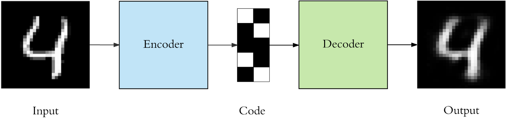
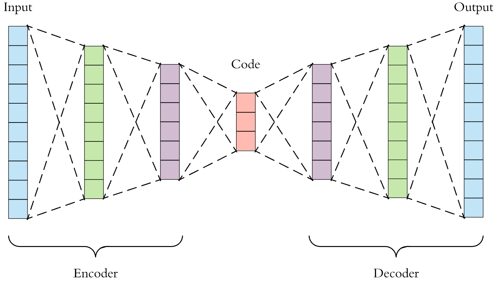
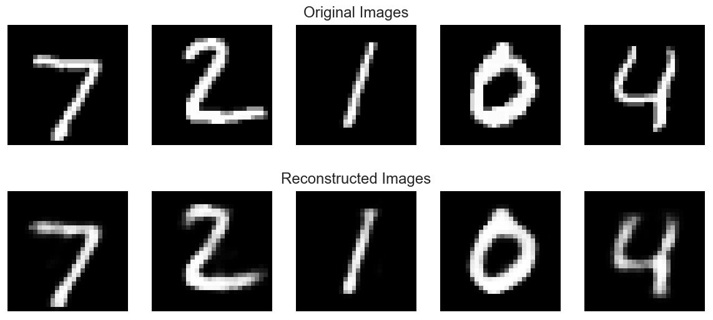
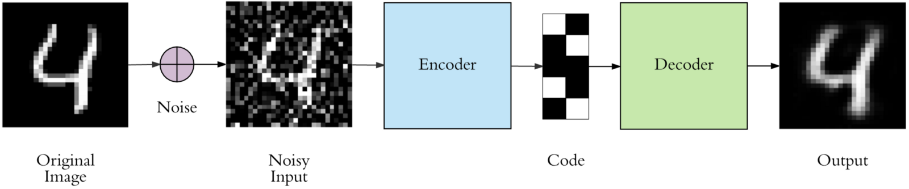

[https://towardsdatascience.com/applied-deep-learning-part-3-autoencoders-1c083af4d798]  
Found the above Medium article as I was reading about Autoencoders and it is really good.  
Listing below some of the extracts from the same article:   
•	Autoencoders are a specific type of feedforward neural networks where the input is the same as the output. They compress the input into a lower-dimensional code and then reconstruct the output from this representation. The code is a compact “summary” or “compression” of the input, also called the latent-space representation.  
•	An autoencoder consists of 3 components: encoder, code and decoder. The encoder compresses the input and produces the code, the decoder then reconstructs the input only using this code.    
  
•	To build an autoencoder we need 3 things: an encoding method, decoding method, and a loss function to compare the output with the target.  
•	Autoencoders are mainly a dimensionality reduction (or compression) algorithm  
•	Data specific - Autoencoders are only able to meaningfully compress data similar to what they have been trained on. Since they learn features specific for the given training data, they are different than a standard data compression algorithm like gzip. So we can’t expect an autoencoder trained on handwritten digits to compress landscape photos  
•	Lossy - The output of the autoencoder will not be exactly the same as the input, it will be a close but degraded representation. If you want lossless compression they are not the way to go.  
•	Unsupervised - To train an autoencoder we don’t need to do anything fancy, just throw the raw input data at it. Autoencoders are considered an unsupervised learning technique since they don’t need explicit labels to train on. But to be more precise they are self-supervised because they generate their own labels from the training data.  
•	Both the encoder and decoder are fully-connected feedforward neural networks  
•	Code is a single layer of an ANN with the dimensionality of our choice. The number of nodes in the code layer (code size) is a hyperparameter that we set before training the autoencoder.  
    
•	The goal is to get an output identical with the input. Note that the decoder architecture is the mirror image of the encoder. This is not a requirement but it’s typically the case. The only requirement is the dimensionality of the input and output needs to be the same.  
•	There are 4 hyperparameters that we need to set before training an autoencoder-   
•	Code size: number of nodes in the middle layer. Smaller size results in more compression.  
•	Number of layers: the autoencoder can be as deep as we like. In the figure above we have 2 layers in both the encoder and decoder, without considering the input and output.  
•	Number of nodes per layer - the autoencoder architecture we’re working on is called a stacked autoencoder. The number of nodes per layer decreases with each subsequent layer of the encoder, and increases back in the decoder. Also the decoder is symmetric to the encoder in terms of layer structure. As noted above this is not necessary.  
•	Loss function: we either use mean squared error (mse) or binary crossentropy. If the input values are in the range [0, 1] then we typically use crossentropy, otherwise we use the mean squared error.  
```
model.add(Dense(16, activation='relu')) # this and below line use Sequential API  
model.add(Dense(8, activation='relu')) # we don’t specify the input for each layer, handled automatically by Sequential API  
layer_1 = Dense(16, activation='relu')(input)  # This and below line use Functional API  
layer_2 = Dense(8, activation='relu')(layer_1) # for every layer, we specify what its input is in Functional API  
```
•	The output of Dense method is a callable layer, using the functional API we provide it with the input and store the output. The output of a layer becomes the input of the next layer. With the sequential API the add method implicitly handled this for us.  
•	The last layer uses the sigmoid activation because we need the outputs to be between [0, 1]  
•	model.fit(x_train, x_train) # Remember that the targets of the autoencoder are the same as the input. That’s why we supply the training data as the target.  
  
The images look very similar, but check the last digit 4, there is a noticeable difference  
•	We have total control over the architecture of the autoencoder. We can make it very powerful by increasing the number of layers, nodes per layer and most importantly the code size. Increasing these hyperparameters will let the autoencoder to learn more complex codings. But we should be careful to not make it too powerful. Otherwise the autoencoder will simply learn to copy its inputs to the output, without learning any meaningful representation. It will just mimic the identity function  
•	It won’t be able to directly copy its inputs to the output, and will be forced to learn intelligent features. If the input data has a pattern, for example the digit “1” usually contains a somewhat straight line and the digit “0” is circular, it will learn this fact and encode it in a more compact form  
•	Keeping the code layer small forced our autoencoder to learn an intelligent representation of the data. There is another way to force the autoencoder to learn useful features, which is adding random noise to its inputs and making it recover the original noise-free data.  
•	We are asking it to subtract the noise and produce the underlying meaningful data. This is called a denoising autoencoder.  
•	The top row contains the original images. We add random Gaussian noise to them and the noisy data becomes the input to the autoencoder. The autoencoder doesn’t see the original image at all. But then we expect the autoencoder to regenerate the noise-free original image.  
    
•	We trained the regular autoencoder as follows: autoencoder.fit(x_train, x_train)  
•	Denoising autoencoder is trained as: autoencoder.fit(x_train_noisy, x_train)  
•	We can do better by using more complex autoencoder architecture, such as convolutional autoencoders  
•	We introduced two ways to force the autoencoder to learn useful features: keeping the code size small and denoising autoencoders. The third method is using regularization.  
•	We can regularize the autoencoder by using a sparsity constraint such that only a fraction of the nodes would have nonzero values, called active nodes.  
•	we add a penalty term to the loss function such that only a fraction of the nodes become active. This forces the autoencoder to represent each input as a combination of small number of nodes, and demands it to discover interesting structure in the data. This method works even if the code size is large, since only a small subset of the nodes will be active at any time.  
•	The final loss of the sparse model is 0.01 higher than the standard one, due to the added regularization term.  
•	Unfortunately autoencoders are not widely used in real-world applications. As a compression method, they don’t perform better than its alternatives, for example jpeg does photo compression better than an autoencoder. And the fact that autoencoders are data-specific makes them impractical as a general technique  
•	Use cases of Autoencoders - Data denoising: we have seen an example of this on images.  
•	dimensionality reduction: visualizing high-dimensional data is challenging. t-SNE is the most commonly used method but struggles with large number of dimensions (typically above 32). So autoencoders are used as a preprocessing step to reduce the dimensionality, and this compressed representation is used by t-SNE to visualize the data in 2D space  
•	Variational Autoencoders (VAE): VAE learns the parameters of the probability distribution modeling the input data, instead of learning an arbitrary function in the case of vanilla autoencoders. By sampling points from this distribution we can also use the VAE as a generative model  


**Update 1:** - Author of the blog also published a notebook that has the code to run and try autoencoders. He used MNIST dataset.  I ran through the code on Colab and it worked without any issues.  

**Update 2:** The same author has written few more articles on Medium. The one about CNN is in-depth and very illustrative. He shared a notebook which has code for creating vizualisations for features, feature maps and outputs.
