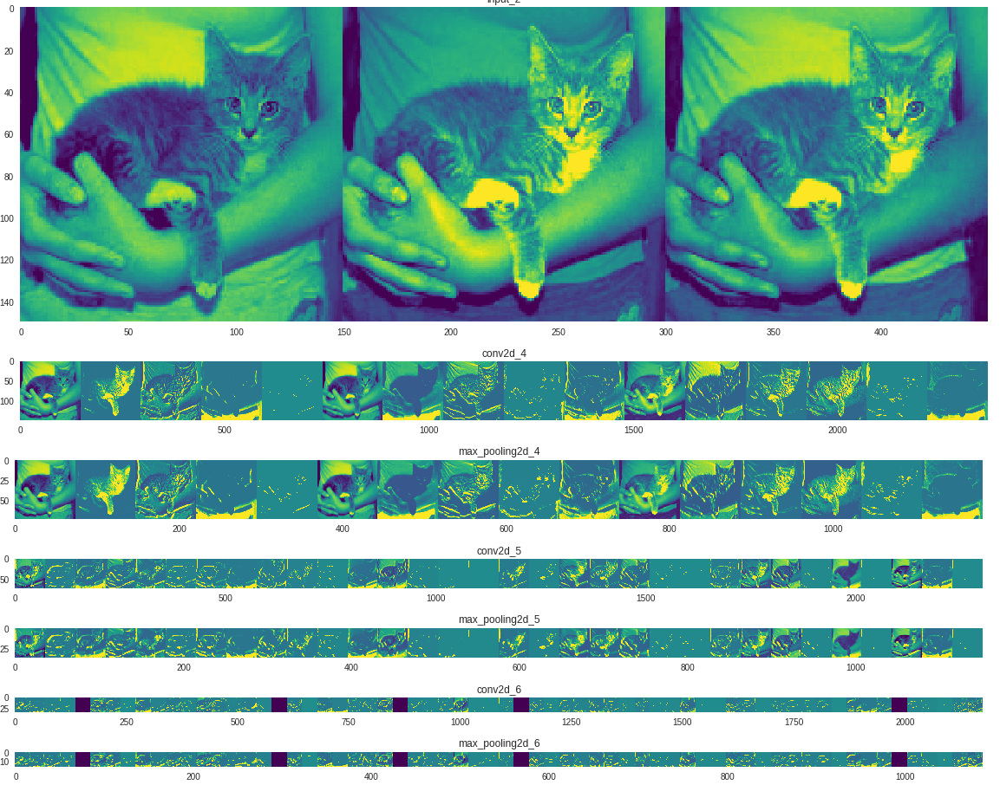

[https://developers.google.com/machine-learning/practica/image-classification/]   
This is a new interactive course from Google about how to do image classification.  
Machine Learning Crash Course was openly launched sometime back which is really good.  
I'm still going through this interactive walk through and this too is really good.  
Specially the part in the exercise in which there was a visualiation of how different features are extracted using filters in different layers.  
I haven't gone into the details of the code yet from Exercise 1. I just ran it through to see what all it does.  

13/6/2018:  
The images that will go into our convnet are 150x150 color images (in the next section on Data Preprocessing, we'll add handling to resize all the images to 150x150 before feeding them into the neural network).  
Let's code up the architecture. We will stack 3 {convolution + relu + maxpooling} modules. Our convolutions operate on 3x3 windows and our maxpooling layers operate on 2x2 windows. Our first convolution extracts 16 filters, the following one extracts 32 filters, and the last one extracts 64 filters.  

NOTE: This is a configuration that is widely used and known to work well for image classification. Also, since we have relatively few training examples (1,000), using just three convolutional modules keeps the model small, which lowers the risk of overfitting.   

x = layers.Conv2D(16, 3, activation='relu')(img_input)
x = layers.MaxPooling2D(2)(x)  

The standard way is to do maxpooling after the activation  

conv2d_1 (Conv2D)            (None, 148, 148, 16)      448    

448 is the number of parameters. And it is 448 because:  
We have used 3X3 convolution filters. Each filter has 3 channels. So it is 3X3X3 = 27 values that need to be optimized.  
We have used 16 filters so it's 27 X 16 = 432. Adding bias for each filter, another 16 should be added which gives us 448.  

Similarly after the next convlution we have :    
conv2d_2 (Conv2D)            (None, 72, 72, 32)        4640   
We have 4640 parameters here because - input has 16 channels. 3 X 3 X 16 gives 144 for each new filter.  
Since we used 32 filters, we have 144 X 32 = 4608 parameters.  Adding bias for each filter gives 4608 + 32 = 4640 parameters.  
Remember, we are only specifying the kernal dimension as 3. It will automatically take it as a 3 X 3 filter and the number of channels of each filter is matched with the channel size of the input.  

We will train our model with the binary_crossentropy loss, because it's a binary classification problem and our final activation is a sigmoid  

We will use the rmsprop optimizer with a learning rate of 0.001. During training, we will want to monitor classification accuracy.  

In this case, using the RMSprop optimization algorithm is preferable to stochastic gradient descent (SGD), because RMSprop automates learning-rate tuning for us. (Other optimizers, such as Adam and Adagrad, also automatically adapt the learning rate during training, and would work equally well here.)  

As you can see we go from the raw pixels of the images to increasingly abstract and compact representations. The representations downstream start highlighting what the network pays attention to, and they show fewer and fewer features being "activated"; most are set to zero. This is called "sparsity." Representation sparsity is a key feature of deep learning.  

These representations carry increasingly less information about the original pixels of the image, but increasingly refined information about the class of the image. You can think of a convnet (or a deep network in general) as an information distillation pipeline.  

verbose=0 will show you nothing (silent),verbose=1 will show you an animated progress bar, 'verbose=2' will just mention the number of epoch  

Below image shows how the features learn in different layers:  

If we train a new network using this data augmentation configuration, our network will never see the same input twice. However the inputs that it sees are still heavily intercorrelated, so this might not be quite enough to completely get rid of overfitting.  

Before having data augmentation and dropout, each epoch took few seconds. With augmentation, it is around 80s.  

First, we need to pick which intermediate layer of Inception V3 we will use for feature extraction. A common practice is to use the output of the very last layer before the Flatten operation, the so-called "bottleneck layer." The reasoning here is that the following fully connected layers will be too specialized for the task the network was trained on, and thus the features learned by these layers won't be very useful for a new task. The bottleneck features, however, retain much generality.  

By specifying the include_top=False argument, we load a network that doesn't include the classification layers at the top—ideal for feature extraction.  

If you add a randomly initialized classifier on top of a pretrained model and attempt to train all layers jointly, the magnitude of the gradient updates will be too large (due to the random weights from the classifier), and your pretrained model will just forget everything it has learned.  

The layer we will use for feature extraction in Inception v3 is called mixed7. It is not the bottleneck of the network, but we are using it to keep a sufficiently large feature map (7x7 in this case). (Using the bottleneck layer would have resulting in a 3x3 feature map, which is a bit small.)   

we fine-tune only the top layers of the pre-trained model rather than all layers of the pretrained model because, in a convnet, the higher up a layer is, the more specialized it is. The first few layers in a convnet learn very simple and generic features, which generalize to almost all types of images. But as you go higher up, the features are increasingly specific to the dataset that the model is trained on. The goal of fine-tuning is to adapt these specialized features to work with the new dataset.  

 
